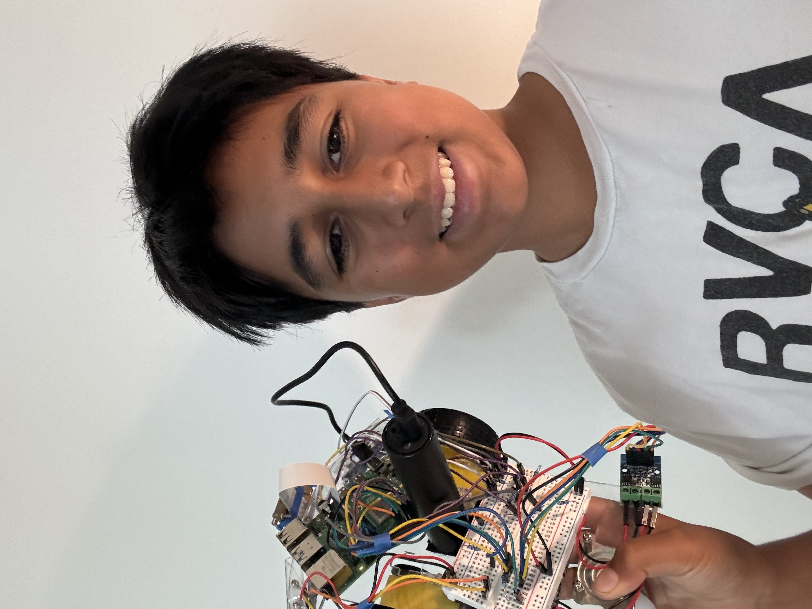
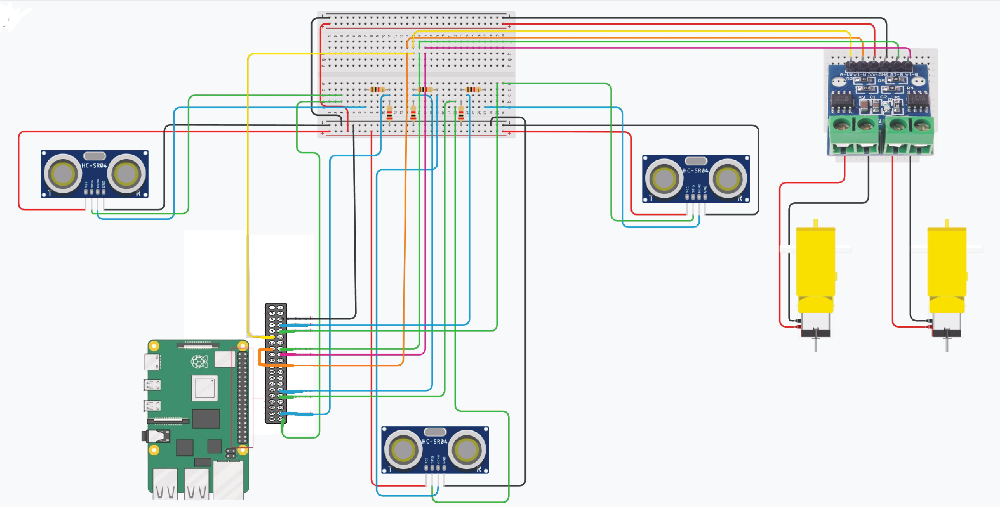

# Ball Tracking Robot
This rover uses a Picam to detect a red ball in front of it, moves towards it, and uses ultrasonic sensors to stop it when it gets too close. While I had some trouble with code, I overcame my challenges and completed this robot with my modifications.

| **Engineer** | **School** | **Area of Interest** | **Grade** |
|:--:|:--:|:--:|:--:|
| Devan G | Marin Academy | Electrical Engineering | Incoming Sophmore


  
# Final Milestone

<iframe width="560" height="315" src="https://www.youtube.com/embed/qtaJhYmrjJM" title="Devan G milestone 3" frameborder="0" allow="accelerometer; autoplay; clipboard-write; encrypted-media; gyroscope; picture-in-picture; web-share" referrerpolicy="strict-origin-when-cross-origin" allowfullscreen></iframe>

My final milestone was the addition of my modification. Because I noticed my robot would not be able to track the ball unless it was in its camera frame, I decided that I wanted the robot to rotate around in a circle. This would make it so that eventually the robot would find the ball and drive towards it. I then added some logic to track the ball, creating a new variable called ball. Ball is set at 0 and if the ball is on the left, ball = 1, if the ball is on the right, ball = 2, and if ball is in the middle, ball = 0. With this information, if the ball goes offscreen because the car ran into it or my dog picked it up, it would rotate in the correct direction instead of flipping a coin and hoping it went the right way. That concludes my modification. Some troubles I had with this was not allowing enough time for the car actually to turn, as the delays were too short. I fixed this by lengthening the delays and adding stops in the right places. While this was not my biggest challenge, like the car overturning, it still negatively affected my results.


# Second Milestone

<iframe width="560" height="315" src="https://www.youtube.com/embed/LuN9dsypy-Q" title="Devan G milestone 2" frameborder="0" allow="accelerometer; autoplay; clipboard-write; encrypted-media; gyroscope; picture-in-picture; web-share" referrerpolicy="strict-origin-when-cross-origin" allowfullscreen></iframe>

My second milestone was the completion of my base project. I now have a robot that tracks and moves towards a red ball. The first part of this milestone was configuring the Picam to detect the ball. To do this, we had the Picam mask out of all colors besides red. Because the ball is the only red item in the sight of the Picam, it makes the red ball the only thing shown once masked. Once we isolate the ball, we then use a function that finds the largest blob on the screen, which in this case will be the ball, and tells us the location of it. With some < or > signs, we can use where it is placed on the screen to tell how far the car needs to turn so it can drive directly toward it. I had a lot of errors with how far the car would turn, as it would overturn because of the camera's frame rate being too slow, causing it to detect the ball to much. This was solved by finding the part of the code that took up the most time and fixing it so it wouldn't cause as many delays. My next milestone will be modifications, which will make my robot turn around looking for the ball when the ball is not detected.

# First Milestone

<iframe width="560" height="315" src="https://www.youtube.com/embed/bshj6nONh2Y" title="Devan G bluestamp" frameborder="0" allow="accelerometer; autoplay; clipboard-write; encrypted-media; gyroscope; picture-in-picture; web-share" referrerpolicy="strict-origin-when-cross-origin" allowfullscreen></iframe>

My first milestone is the compilation of all my components. This includes setting up a Raspberry Pi, which I had  trouble with. While trying to connect Visual Studio Code to the Raspberry Pi, an error saw me choosing the wrong OS for the Raspberry Pi in the selection menu in Visual Studio Code. While this error was a little annoying, it was worth going through so now in the future I understand what OS my Pi runs. This Pi will run the code that will control the motors in the car, however, it needs an H-Bridge to intermediate the communication between the two. The H-Bridge is essentially a middleman that reads the code from the Raspberry Pi and tells the motors what to do. Connected to the Raspberry Pi is also a camera, called Pi cam, which in the future, will be used to find out where the ball is and communicate back to the Pi that we need to move towards it. While the car is moving towards the ball, it might run into obstacles. For that, we have ultrasonic sensors attached to the car, making sure that if it gets too close to a wall, desk, pet, etc, it will not run into it. The next step will be to add more code so that the car will be able to track the ball and move towards it.


# Schematics 


# Code


```c++
import cv2
from picamera2 import Picamera2, Preview
import RPi.GPIO as gpio
import time              
import numpy as np

ball = 0

gpio.setmode(gpio.BCM)
gpio.setwarnings(False)
gpio.setup(17, gpio.OUT)
gpio.setup(22, gpio.OUT)
gpio.setup(23, gpio.OUT)
gpio.setup(24, gpio.OUT)

from gpiozero import DistanceSensor

def distanceSensor():
  ultrasonic1 = DistanceSensor(echo=14, trigger=15, threshold_distance=0.5)
  ultrasonic2 = DistanceSensor(echo=20, trigger=21, threshold_distance=0.5)
  ultrasonic3 = DistanceSensor(echo=5, trigger=6, threshold_distance=0.5)
  return ultrasonic3.distance * 100, ultrasonic2.distance * 100, ultrasonic1.distance * 100
  

def reverse():

 gpio.output(17, True)
 gpio.output(22, False)
 gpio.output(23, True) 
 gpio.output(24, False)


def forward():

 gpio.output(17, False)
 gpio.output(22, True)
 gpio.output(23, False) 
 gpio.output(24, True)


def stop(sec):
 
 gpio.output(17, False)
 gpio.output(22, False)
 gpio.output(23, False) 
 gpio.output(24, False)
 time.sleep(sec)

def sharpRight():
 
 gpio.output(17, True)
 gpio.output(22, False)
 gpio.output(23, False) 
 gpio.output(24, True)
 
def right():
 
 gpio.output(17, False)
 gpio.output(22, False)
 gpio.output(23, False) 
 gpio.output(24, True)
 
 

def sharpLeft():
 
 gpio.output(17, False)
 gpio.output(22, True)
 gpio.output(23, True) 
 gpio.output(24, False)

def left():
 
 gpio.output(17, gpio.LOW)
 gpio.output(22, gpio.HIGH)
 gpio.output(23, gpio.LOW) 
 gpio.output(24, gpio.LOW)

def segment_colour(frame):   
    hsv_roi =  cv2.cvtColor(frame, cv2.COLOR_RGB2HSV)
    
    mask_1 = cv2.inRange(hsv_roi, np.array([100, 190,1]), np.array([190,255,255]))
    
    mask = mask_1 
    kern_dilate = np.ones((12,12),np.uint8)
    kern_erode  = np.ones((6,6),np.uint8)
    mask = cv2.erode(mask, kern_erode)
    mask = cv2.dilate(mask, kern_dilate)
    
    (h,w) = mask.shape
    
    
    
    #cv2.imshow('mask', mask) 
    
    return mask


def find_blob(blob):  
    largest_contour=0
    cont_index=0
    contours, hierarchy = cv2.findContours(blob, cv2.RETR_CCOMP, cv2.CHAIN_APPROX_SIMPLE)
    for idx, contour in enumerate(contours):
        area=cv2.contourArea(contour)
        if (area >largest_contour):
            largest_contour=area
            cont_index=idx
                    
    r=(0,0,2,2)
    if len(contours) > 0:
        r = cv2.boundingRect(contours[cont_index])
        
     
    return r,largest_contour


picam2 = Picamera2()

camera_config = picam2.create_still_configuration(main={"size": (1920, 1080)}, lores={"size": (480, 270)}, display="lores")

picam2.configure(camera_config)
#picam2.start_preview(Preview.QTGL)  
picam2.start()

time.sleep(2)


while(True):

    distance1, distance2, distance3 = distanceSensor()
    #print(distance1, distance2, distance3)


    startTime = time.time()
    
    if distance1 < 5:
       stop(5)
    if distance2 < 5:
       stop(5)
    if distance3 < 5:
       stop(5)
    
    im = picam2.capture_array()
    height = im.shape[0]
    width = im.shape[1]
     
    mask_red=segment_colour(im[:,:,[0,1,2]])
    loct,area=find_blob(mask_red)
    x,y,w,h=loct
    print(area, loct)
    centerx = x + w/2
    centery = y + h/2
    center = (centerx, centery)
    print(center)
    #if area > 1100000:
        #stop(1)
    if centerx < 200 and centerx > 0 and area > 10000:
        left()
        time.sleep(0.05)
        stop(0.01)
        print("left")
        ball = 1
    elif centerx > 1700:
        time.sleep(0.05)
        right()
        stop(0.01)
        print("right")
    elif centerx > 1600 and area > 10000:
        ball = 2
    else:
        stop(0.01)
        forward()
        time.sleep(0.05)
        print("forward")
        ball = 0
    if area < 100000 and ball == 1:
        stop(0.01)
        sharpLeft()
        print("sharp left")
        time.sleep(0.05)
        stop(0.01)
    elif area < 100000 and ball == 2:
        stop(0.01)
        sharpRight()
        print("sharp right")
        time.sleep(0.1)
        stop(0.01)
    elif area < 100000 and ball == 0:
        stop(0.01)
        sharpRight()
        print("sharp right")
        time.sleep(0.1)
        stop(0.01)
    stopTime = time.time()
    elapsedTime = stopTime - startTime
    #print(elapsedTime)
    print(ball)
```

# Bill of Materials

| **Part** | **Note** | **Price** | **Link** |
|:--:|:--:|:--:|:--:|
| Raspberry Pi Kit | Brains of the operation; sends code to H-Bridge and receives information from the camera and sensors | $95.19 | <a href="https://www.amazon.com/RasTech-Raspberry-Starter-Heatsink-Screwdriver/dp/B0C8LV6VNZ/ref=sr_1_4?crid=3506HY00MCGVM&dib=eyJ2IjoiMSJ9._zkM62vSQ8p7tNr88715LdMv_qHh72Je-tkF9PXEa3chDE53QT4aZu4AGAb4ihE61QY4ZD55nKF6Fp2Kfs8t7AbafM_JrlJFfHo9OB4eAVGqa0EB-7aoBQHPmhKHZ2MW8ny-Kd44bMVlVxPlTWVk5YHIN5P3uKVqrE5Dcal0rKkHny-O6Xyb5ux2AOU6OwVbkag_bqBX66RQNRrgBuz-0pS43mcx93IZTQA9R8NaJJypYU2HAycp-XicTFmyU60a01Nfm9iuyo6B9yA8ppN3OQQyJ-NQ9xyNPxfTLwkqtng.yAYpU6outhQcZmOZhN9Wb6yTw7A85CNUbXZguGInZNg&dib_tag=se&keywords=raspberry%2Bpi%2Bkit&qid=1718848547&s=electronics&sprefix=rasbperry%2Bpi%2Bkit%2Celectronics%2C83&sr=1-4&th=1"> Link </a> |
| Robot Chassis | Holds all the components | $18.99 | <a href="https://www.amazon.com/Smart-Chassis-Motors-Encoder-Battery/dp/B01LXY7CM3/ref=sr_1_5?crid=373Y5YK6JWMD&keywords=robot+chassis&qid=1687740144&sprefix=robot+chassi%2Caps%2C93&sr=8-5"> Link </a> |
| Screwdriver Kit | Used to screw screws in | $5.94 | <a href="https://www.amazon.com/Small-Screwdriver-Set-Mini-Magnetic/dp/B08RYXKJW9/"> Link </a> |
| Ultrasonic Sensor | Detect the distance from objects | $9.99 | <a href="https://www.amazon.com/WWZMDiB-HC-SR04-Ultrasonic-Distance-Measuring/dp/B0CQCCGXCP/ref=sr_1_1_sspa?crid=3J2JR973WKPHO&dib=eyJ2IjoiMSJ9.E2SIkElJhtFWCJCHL5Q6Y73Ys_HCMPRVFCIrG_zKv4Og7BdZNtr69Mkju140lhlfzFGQuY542jpsp8FMrtV9d2hCBI7D8lYTH9bcgDXZhs4941uj-d1D69ZYdKmAI1Jig3VmYXOl3axVQ8Jq5L3nGRymNMtNbxkaFqGNyzkq4p37hhxU6jheuoaMo3Onz2FE9ILThkjUbdxRNW3rrZgZ7bYj9mf-yav85hBAmNduYyo.EneY3GmHDfDjDwhdUdDQ4Ktk6fECH62Adb42cEkehRc&dib_tag=se&keywords=ultrasonic%2Bsensor&qid=1715961326&sprefix=ultrasonic%2Bsensor%2Caps%2C72&sr=8-1-spons&sp_csd=d2lkZ2V0TmFtZT1zcF9hdGY&th=1"> Link </a> |
| H Bridges | Receives commands from the Raspberry Pi and sends them to motors| $7.79 | <a href="https://www.amazon.com/HiLetgo-H-bridge-Stepper-Controller-Arduino/dp/B00M0F243E/ref=pd_lpo_sccl_1/142-4739935-9789822?pd_rd_w=5sLcA&content-id=amzn1.sym.4c8c52db-06f8-4e42-8e56-912796f2ea6c&pf_rd_p=4c8c52db-06f8-4e42-8e56-912796f2ea6c&pf_rd_r=KR0X36CCWH30E7T108Y9&pd_rd_wg=1cZ0l&pd_rd_r=420e26d6-ea71-4fc7-adcf-6cf8ffb38079&pd_rd_i=B00M0F243E&psc=1"> Link </a> |
| Pi Cam | Used to find where the ball is | $12.86 | <a href="https://www.amazon.com/gp/product/B07RWCGX5K/ref=ox_sc_act_title_1?smid=A2IAB2RW3LLT8D&psc=1"> Link </a> |
| Electronics Kit | Wires, resistors, and a breadboard for all the components | $11.98 | <a href="https://www.amazon.com/EL-CK-002-Electronic-Breadboard-Capacitor-Potentiometer/dp/B01ERP6WL4/ref=sr_1_4?crid=30T5LTYVQLQ7Z&dib=eyJ2IjoiMSJ9.XZtpck6Llt4UIuYeKM4X3BoXzDuzolZMTCtFDj-oTh1vuIi0HYJZJEdpS-MCdGCK1AWUbUmgoEswoRPxGUSKeGRTzsciRE_l2Vrp8FGX1SxK-HmibPNyHBEtkFJKo_OYmMhkhdCJ4OIH38ALRfFvrXZ7OU5faZVvkTBqod8p7UZYwNwdLCcimwFWGWKaDa-gbbx_TGk7lYQmEbrzeL4UXM-gW3RDtuOV0dCykxwyvYJKCCcOhrK3f18N4NZjiqL_Y5noE1rQTmwyFcG67DzgpNaUPanwIQaYfCe5mgD-njY.v6mU1wYX4M5ShCiyrZMey0hbOwvqLszD8axpHbKlA6I&dib_tag=se&keywords=mini+breadboard+kit&qid=1716419767&s=electronics&sprefix=mini+breadboard+kit%2Celectronics%2C106&sr=1-4"> Link </a> |
| Motors | To make the car go forward | $11.98 | <a href="https://www.amazon.com/AEDIKO-Motor-Gearbox-200RPM-Ratio/dp/B09N6NXP4H/ref=sr_1_4?crid=1JP29NIWBLH2M&dib=eyJ2IjoiMSJ9.Wq3jKgOLbqtEP772vMD4pV5f-w3PLBdEpKqguykXOb0JFO14f4Dq0m_VDVUMUFtR8WFINUEticI3GXcoGqwXPqK9yIh04PhCktgccMz9zAUiKXMJPwmOTUp_6av3XuFD0lXo9WngN9iKI6YgZrhEEs9qnqbcB1GnvgntCdKz8Q1dFuNu61NgSE6Z8vBk3FRpaNcr1lCI7FApTiNi0Qce8gbfmMn6oUggZQHpIOKKZ6s.M7WsZ_ZZtm3rm93kKgw0NOxt1McVBYX6m55oGxu1xxI&dib_tag=se&keywords=dc+motor+with+gearbox&qid=1715911706&sprefix=dc+motor+with+gearbox%2Caps%2C126&sr=8-4"> Link </a> |
| DMM | To test the voltage of the batteries | $11 | <a href="https://www.amazon.com/AstroAI-Digital-Multimeter-Voltage-Tester/dp/B01ISAMUA6/ref=sxin_17_pa_sp_search_thematic_sspa?content-id=amzn1.sym.e8da13fc-7baf-46c3-926a-e7e8f63a520b%3Aamzn1.sym.e8da13fc-7baf-46c3-926a-e7e8f63a520b&cv_ct_cx=digital+multimeter&dib=eyJ2IjoiMSJ9.5LQumrfBR8l0mKnJCJlRg73dxpou0gqYD_ffU3srgs0Utegwth8GcQCSVXVzeZeLSJx5J3itz5TLdmJHsrVITQ.-00jRPoT-bBy26YC4LzQ-S4cYdztgmSMGb83_WEm6HY&dib_tag=se&keywords=digital+multimeter&pd_rd_i=B01ISAMUA6&pd_rd_r=e1ff2570-7e4a-4906-bc55-6f819d48d1bc&pd_rd_w=h7HgL&pd_rd_wg=0ZcFH&pf_rd_p=e8da13fc-7baf-46c3-926a-e7e8f63a520b&pf_rd_r=R6YKX3NXTDQ1PQP4H8RM&qid=1715911879&sbo=RZvfv%2F%2FHxDF%2BO5021pAnSA%3D%3D&sr=1-1-7efdef4d-9875-47e1-927f-8c2c1c47ed49-spons&sp_csd=d2lkZ2V0TmFtZT1zcF9zZWFyY2hfdGhlbWF0aWM&psc=1"> Link </a> |
| AA Bateries | Power the cards | $14.89 | <a href="https://www.amazon.com/Energizer-Batteries-Double-Alkaline-Battery/dp/B07TXNX6S2/ref=sr_1_8?crid=2Z92KWYJCEV4C&dib=eyJ2IjoiMSJ9.dtP_LjZ3n55Hl_vfONYcp2Yt-k3sdCQ3aoBRCYeyTDCJ82ozrmrPxo-6Tr4waSviK9o963tO4XU9etNcf1xOPvNGHLDY4bsnRPXSlry5pzg1f8E4bWO0BYSU8hIMC5dsOpkzclVaZgrmIbW8NZgWtTxSa7_pA4e7DDVE7eEQ0ET5hocBS4_Y5e755cH3YxE9_mAvjujhceYX3ReQamwRcgHX8QK-DhZuspvK1OU9KUA.vnGDnHsJH3R8dzynuZmiz-qIPu2mUbpk_jFQHsW0xb8&dib_tag=se&keywords=AA+batteries&qid=1715957810&refinements=p_85%3A2470955011&rnid=2470954011&rps=1&sprefix=aa+batterie%2Caps%2C88&sr=8-8"> Link </a> |
| Champion Sports Ball | The ball that is detected | $12.34 | <a href="https://www.amazon.com/Champion-Sports-Coated-Density-8-5-Inch/dp/B000KYQ410/ref=pd_lpo_sccl_1/142-4739935-9789822?pd_rd_w=uDrsq&content-id=amzn1.sym.4c8c52db-06f8-4e42-8e56-912796f2ea6c&pf_rd_p=4c8c52db-06f8-4e42-8e56-912796f2ea6c&pf_rd_r=0VXWNQB5508GXN7H55RW&pd_rd_wg=8uq7L&pd_rd_r=aa130b62-c739-4591-b544-8b45dc9a1d92&pd_rd_i=B0CN8XJZ23&th=1&psc=1"> Link </a> |
| USB Power Bank and Cable | Power the Pi | $16.19 | <a href="https://www.amazon.com/SIXTHGU-Portable-Charger-Charging-Flashlight/dp/B0C7PHKKNK/ref=sr_1_2_sspa?crid=2ZZM4AAZMMWHQ&dib=eyJ2IjoiMSJ9.W2Zx5_I3mKOn6UpwAzOw6PD0PNh1iaMRBiedequdv9weeWL0HPyPcxJBR9h6-LiFW-sHKnHSApN0sUxx0Q9xIRs80R57IlvvCsmEzXcktogo-4nP-NxrEZOy5dJTcXY8N-PBwfGt4fl_9LP8npenzDUV9TPA8KN6DMu175g6JegC_gZhAJrbqX94EfpQhLwP9vIJH45w2N-AFrfZZOy9jqk55gzVyk4Qst8uZvqn768.KBrc5_SqZ4e8zCpoFc-1C7rk02t3o2ykgDPB65W5JJU&dib_tag=se&keywords=always%2Bon%2Bpower%2Bbank&qid=1715957917&sprefix=always%2Bon%2Bpower%2Bbank%2Caps%2C107&sr=8-2-spons&sp_csd=d2lkZ2V0TmFtZT1zcF9hdGY&th=1"> Link </a> |
