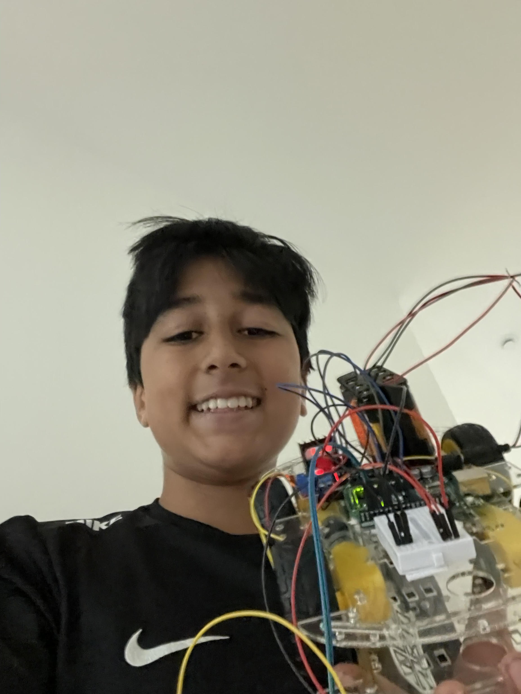
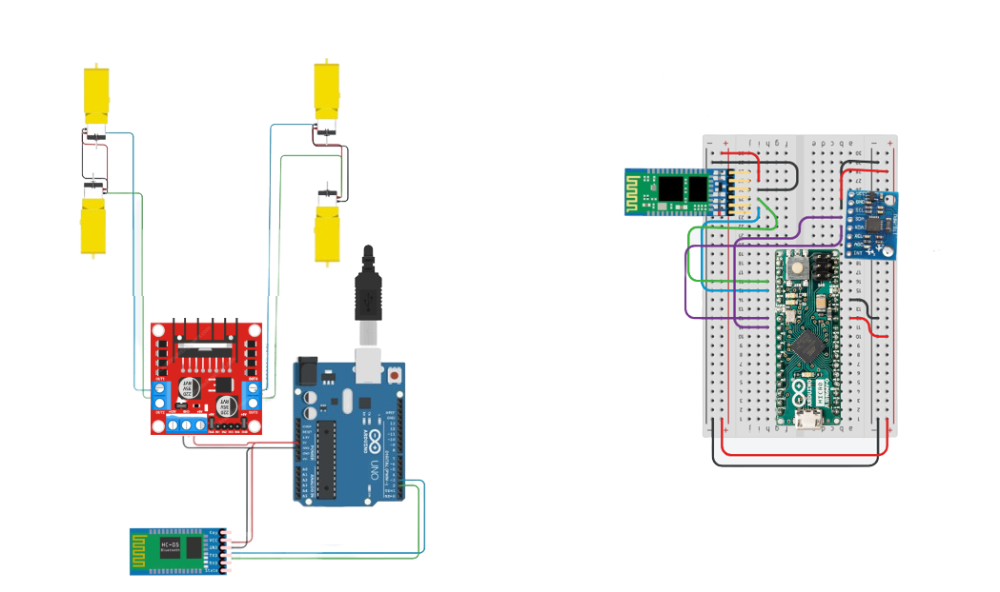
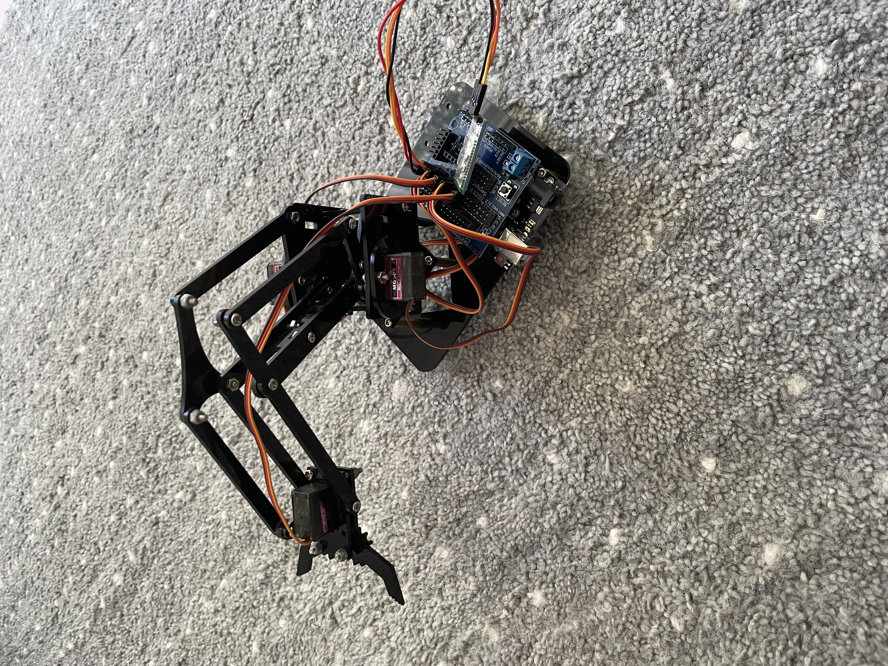
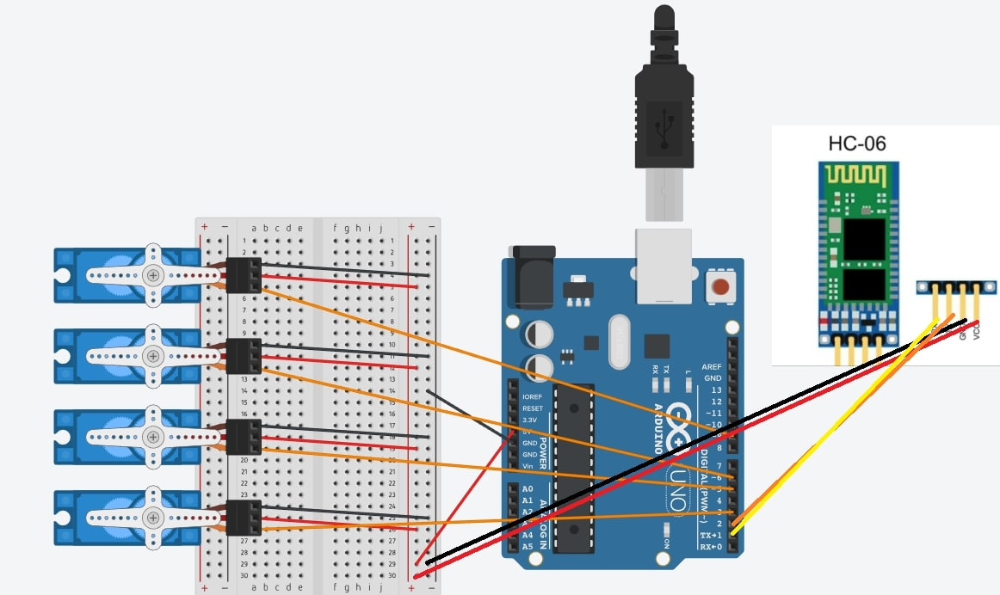

# Devan G - BlueStamp Engineering Portfolio
## Complete Project Collection (2021-2024)

| **Engineer** | **School** | **Area of Interest** | **Years** |
|:--:|:--:|:--:|:--:|
| Devan G | Marin Academy (formerly Mark Day School) | Electrical Engineering | 2021-2024

---

## About This Portfolio

This portfolio showcases my journey through four years of BlueStamp Engineering summer programs. Each year brought new challenges, more sophisticated projects, and deeper understanding of electrical engineering and robotics. From learning basic API integration as a rising 7th grader to implementing computer vision as an incoming sophomore, these projects document my growth as an engineer.

---

## Project Timeline

### [2024 - Ball Tracking Robot](#project-4-ball-tracking-robot-2024)
*Incoming Sophomore | Computer Vision & Robotics*

### [2023 - Gesture Controlled Rover](#project-3-gesture-controlled-rover-2023)
*Incoming Freshman | Wireless Communication & Sensors*

### [2022 - Phone Controlled Robot Arm](#project-2-phone-controlled-robot-arm-2022)
*Rising 8th Grader | Mobile App Development & Bluetooth*

### [2021 - IOT Weather Indicator](#project-1-iot-weather-indicator-2021)
*Rising 7th Grader | API Integration & Display Programming*

---

# Project 4: Ball Tracking Robot (2024)

**Grade:** Incoming Sophomore
**Technologies:** Raspberry Pi 5, OpenCV, PiCam, Ultrasonic Sensors, GPIO Control, Python

## Project Overview

This rover uses a PiCam to detect a red ball in front of it, moves towards it, and uses ultrasonic sensors to stop when it gets too close. The project implements computer vision using OpenCV for color segmentation and blob detection. While I had some trouble with code optimization and camera frame rates, I overcame my challenges and completed this robot with intelligent tracking modifications.

<div align="center">
  
</div>

## Video Demonstrations

### Final Milestone
<iframe width="560" height="315" src="https://www.youtube.com/embed/qtaJhYmrjJM" title="Devan G milestone 3" frameborder="0" allow="accelerometer; autoplay; clipboard-write; encrypted-media; gyroscope; picture-in-picture; web-share" referrerpolicy="strict-origin-when-cross-origin" allowfullscreen></iframe>

**Modification: Intelligent Search Pattern**

My final milestone was the addition of my modification. Because I noticed my robot would not be able to track the ball unless it was in its camera frame, I decided that I wanted the robot to rotate around in a circle. This would make it so that eventually the robot would find the ball and drive towards it.

I then added some logic to track the ball, creating a new variable called `ball`. Ball is set at 0, and if the ball is on the left, ball = 1, if the ball is on the right, ball = 2, and if the ball is in the middle, ball = 0. With this information, if the ball goes offscreen because the car ran into it or my dog picked it up, it would rotate in the correct direction instead of flipping a coin and hoping it went the right way.

Some troubles I had with this was not allowing enough time for the car to turn, as the delays were too short. I fixed this by lengthening the delays and adding stops in the right places. While this was not my biggest challenge, like the car overturning, it still negatively affected my results.

### Second Milestone
<iframe width="560" height="315" src="https://www.youtube.com/embed/LuN9dsypy-Q" title="Devan G milestone 2" frameborder="0" allow="accelerometer; autoplay; clipboard-write; encrypted-media; gyroscope; picture-in-picture; web-share" referrerpolicy="strict-origin-when-cross-origin" allowfullscreen></iframe>

**Color Masking and Object Detection**

My second milestone was the completion of my base project. I now have a robot that tracks and moves towards a red ball. The first part of this milestone was configuring the Picam to detect the ball. To do this, we had the Picam mask out all colors besides red. Because the ball is the only red item in the sight of the Picam, it makes the red ball the only thing shown once masked.

Once we isolate the ball, we then use a function that finds the largest blob on the screen, which in this case will be the ball, and tells us the location of it. With some < or > signs, we can use where it is placed on the screen to tell how far the car needs to turn so it can drive directly toward it.

I had a lot of errors with how far the car would turn, as it would overturn because of the camera's frame rate being too slow, causing it to detect the ball too much. This was solved by finding the part of the code that took up the most time and fixing it so it wouldn't cause as many delays.

### First Milestone
<iframe width="560" height="315" src="https://www.youtube.com/embed/bshj6nONh2Y" title="Devan G bluestamp" frameborder="0" allow="accelerometer; autoplay; clipboard-write; encrypted-media; gyroscope; picture-in-picture; web-share" referrerpolicy="strict-origin-when-cross-origin" allowfullscreen></iframe>

**Hardware Assembly and Raspberry Pi Configuration**

My first milestone is the compilation of all my components. This includes setting up a Raspberry Pi, which I had trouble with. While trying to connect Visual Studio Code to the Raspberry Pi, an error saw me choosing the wrong OS for the Raspberry Pi in the selection menu in Visual Studio Code. While this error was a little annoying, it was worth going through so now in the future I understand what OS my Pi runs.

This Pi will run the code that will control the motors in the car, however, it needs an H-Bridge to intermediate the communication between the two. The H-Bridge is essentially a middleman that reads the code from the Raspberry Pi and tells the motors what to do.

Connected to the Raspberry Pi is also a camera, called Pi cam, which in the future, will be used to find out where the ball is and communicate back to the Pi that we need to move towards it. While the car is moving towards the ball, it might run into obstacles. For that, we have ultrasonic sensors attached to the car, making sure that if it gets too close to a wall, desk, pet, etc, it will not run into it.

## Key Features
- **Computer Vision**: OpenCV-based color segmentation for red ball detection
- **Blob Detection**: Identifies and tracks the largest red object in frame
- **Intelligent Movement**: Calculates turn angles based on ball position
- **Obstacle Avoidance**: Three ultrasonic sensors prevent collisions
- **Smart Search**: Remembers last ball position for efficient searching

## Technical Challenges Overcome
1. **Camera Frame Rate Issues**: The robot would overshoot because the camera couldn't keep up with movement
   - **Solution**: Optimized image processing pipeline to reduce latency
2. **OS Configuration**: Struggled with selecting the correct Raspberry Pi OS in VS Code
   - **Solution**: Learned about different OS options and proper configuration
3. **Tracking Logic**: Robot would search randomly when ball was lost
   - **Solution**: Implemented memory variable to track last known ball position

## Schematics
<div align="center">
  
</div>

## Code Highlights

**Color Segmentation Function**
```python
def segment_colour(frame):
    hsv_roi =  cv2.cvtColor(frame, cv2.COLOR_RGB2HSV)

    # Mask for red color
    mask_1 = cv2.inRange(hsv_roi, np.array([100, 190,1]), np.array([190,255,255]))

    mask = mask_1
    kern_dilate = np.ones((12,12),np.uint8)
    kern_erode  = np.ones((6,6),np.uint8)
    mask = cv2.erode(mask, kern_erode)
    mask = cv2.dilate(mask, kern_dilate)

    return mask
```

**Blob Detection and Tracking**
```python
def find_blob(blob):
    largest_contour=0
    cont_index=0
    contours, hierarchy = cv2.findContours(blob, cv2.RETR_CCOMP, cv2.CHAIN_APPROX_SIMPLE)
    for idx, contour in enumerate(contours):
        area=cv2.contourArea(contour)
        if (area >largest_contour):
            largest_contour=area
            cont_index=idx

    r=(0,0,2,2)
    if len(contours) > 0:
        r = cv2.boundingRect(contours[cont_index])

    return r,largest_contour
```

**Intelligent Tracking Logic**
```python
# Track ball position for smart searching
if centerx < 200 and centerx > 0 and area > 10000:
    left()
    ball = 1  # Remember: ball was on the left
elif centerx > 1600 and area > 10000:
    right()
    ball = 2  # Remember: ball was on the right
else:
    forward()
    ball = 0  # Ball is centered

# If ball is lost, search in the last known direction
if area < 100000 and ball == 1:
    sharpLeft()  # Search left
elif area < 100000 and ball == 2:
    sharpRight()  # Search right
```

## Bill of Materials

| **Part** | **Note** | **Price** | **Link** |
|:--:|:--:|:--:|:--:|
| Raspberry Pi Kit | Brains of the operation | $95.19 | [Link](https://www.amazon.com/RasTech-Raspberry-Starter-Heatsink-Screwdriver/dp/B0C8LV6VNZ/) |
| Robot Chassis | Holds all components | $18.99 | [Link](https://www.amazon.com/Smart-Chassis-Motors-Encoder-Battery/dp/B01LXY7CM3/) |
| Ultrasonic Sensors (3x) | Distance detection | $9.99 | [Link](https://www.amazon.com/WWZMDiB-HC-SR04-Ultrasonic-Distance-Measuring/dp/B0CQCCGXCP/) |
| H-Bridge Motor Driver | Motor control | $7.79 | [Link](https://www.amazon.com/HiLetgo-H-bridge-Stepper-Controller-Arduino/dp/B00M0F243E/) |
| Pi Camera | Computer vision | $12.86 | [Link](https://www.amazon.com/gp/product/B07RWCGX5K/) |
| DC Motors with Gearbox | Propulsion | $11.98 | [Link](https://www.amazon.com/AEDIKO-Motor-Gearbox-200RPM-Ratio/dp/B09N6NXP4H/) |
| Champion Sports Ball | Red ball for tracking | $12.34 | [Link](https://www.amazon.com/Champion-Sports-Coated-Density-8-5-Inch/dp/B000KYQ410/) |

**Total Project Cost:** ~$169

---

# Project 3: Gesture Controlled Rover (2023)

**Grade:** Incoming Freshman
**Technologies:** Arduino Uno, Arduino Micro, MPU6050 Accelerometer, HC-05 Bluetooth, Motor Control

## Project Overview

My project is the Gesture Controlled Rover which uses an accelerometer to determine the movements of the rover. It works by communicating wirelessly the values from the accelerometer to the main Arduino board using two Bluetooth modules. While I struggled to connect wires, pair Bluetooth modules, and not break my project, I still completed the project and gained new engineering knowledge.

<div align="center">
  
</div>

## Video Demonstrations

### Final Milestone
<iframe width="560" height="315" src="https://www.youtube.com/embed/0dxR-TbvpAg" title="Bluestamp Milestone 3" frameborder="0" allow="accelerometer; autoplay; clipboard-write; encrypted-media; gyroscope; picture-in-picture; web-share" allowfullscreen></iframe>

**Completing the Accelerometer Controller**

My third milestone was the completion of the project. This means I needed to complete the controller by incorporating an accelerometer. My biggest challenge came with this milestone as my project kept breaking:

- First, the accelerometer stopped working
- Then, I broke my Arduino Micro
- I eventually figured out the accelerometer could not be on the same column as the Arduino Micro

With this project, I have learned about how every part of my project is important:
- The **Bluetooth modules** are needed to make it wireless
- The **Arduinos** are needed to send and receive information from the Bluetooth modules and the code
- The **accelerometer** is needed to send its outputs to the Arduino
- The **Motor Board** is needed to calculate the polarity of the motors and send commands to the motors

In the future, I want to learn all about how my project works down to every last wire. I want to be able to look at a part and say what it does, how it works, and how to set it up with clear, concise answers.

### Second Milestone
<iframe width="560" height="315" src="https://www.youtube.com/embed/R8_csAbHmK4" title="Bluestamp Milestone 2" frameborder="0" allow="accelerometer; autoplay; clipboard-write; encrypted-media; gyroscope; picture-in-picture; web-share" allowfullscreen></iframe>

**Bluetooth Communication Setup**

My second milestone saw me creating a controller to control my car. This will work by using an accelerometer, Bluetooth chip, and Arduino micro to communicate with my Arduino Uno connected to my car. I have not fully completed the controller because I have not added an accelerometer yet.

I struggled with pairing the two Bluetooth modules as you needed one for the Arduino micro and one for the Arduino uno but I eventually realized that I had bad wiring and I needed to unplug certain wires in the pairing process for it to work.

I am surprised at how well my project is working because in the past it has taken me much longer to create my projects.

### First Milestone
<iframe width="560" height="315" src="https://www.youtube.com/embed/nzAVfoaRZ_Q" title="BlueStamp Milestone 1" frameborder="0" allow="accelerometer; autoplay; clipboard-write; encrypted-media; gyroscope; picture-in-picture; web-share" allowfullscreen></iframe>

**Building the Rover Base**

My first milestone entailed the building of the rover:

- While assembling the chassis, I forgot to read all of the instructions which lead to me having to take apart part of the rover and rebuild it the right way
- When I was wiring it, I struggled with connecting the wires
- In the end, I just needed to unscrew the screws on the top of the terminals on the motor board and tighten them once the wires were in

The motor board is essentially the middle man between the Arduino and the motors. It calculates the polarity and regulates the power of the motors. After, I wired my Arduino to the motor board and used source code to get my rover moving.

## Key Features
- **Gesture Control**: Tilt controller forward/back/left/right to control rover
- **Wireless Communication**: Dual HC-05 Bluetooth modules for controller-to-rover link
- **MPU6050 Integration**: 6-axis accelerometer/gyroscope for gesture detection
- **Motor Control**: L293D motor driver for differential drive control

## Technical Challenges Overcome
1. **Bluetooth Pairing**: Two HC-05 modules wouldn't pair initially
   - **Solution**: Discovered bad wiring and learned proper pairing sequence
2. **Accelerometer Placement**: Device would stop working randomly
   - **Solution**: Found that accelerometer couldn't share breadboard column with Arduino
3. **Component Damage**: Broke Arduino Micro during assembly
   - **Solution**: Learned proper handling techniques and got replacement

## Schematics
<div align="center">
  
</div>

## Code Highlights

**Arduino Uno (Receiver - Car)**
```c++
void loop()
{
  // Checks for Bluetooth data
  if (configBt.available()){
    c = (char)configBt.read();
    Serial.println(c);
  }

  // Acts based on character received
  switch(c){
    case 'F': forward(); break;
    case 'L': left(); break;
    case 'R': right(); break;
    case 'B': back(); break;
    case 'S': freeze();
  }
}
```

**Arduino Micro (Transmitter - Controller)**
```c++
void determineGesture()
{
  if (accelerometerY >= 6500) {
    Serial1.write('F');  // Forward
  }
  else if (accelerometerY <= -4000) {
    Serial1.write('B');  // Backward
  }
  else if (accelerometerX <= -3250) {
    Serial1.write('L');  // Left
  }
  else if (accelerometerX >= 3250) {
    Serial1.write('R');  // Right
  }
  else {
    Serial1.write('S');  // Stop
  }
}
```

## Bill of Materials

| **Part** | **Note** | **Price** | **Link** |
|:--:|:--:|:--:|:--:|
| Smart Car Kit | Body and motors | $18.99 | [Amazon](https://www.amazon.com/gp/product/B06VTP8XBQ) |
| 2 Bluetooth Modules | HC-05 for wireless communication | $20.78 | [Amazon](https://www.amazon.com/HiLetgo-Wireless-Bluetooth-Transceiver-Arduino/dp/B071YJG8DR) |
| Arduino Uno | Main controller | $24.00| [Arduino](https://store.arduino.cc/products/arduino-uno-rev3) |
| Arduino Micro | Remote controller | $21.60 | [Arduino](https://store.arduino.cc/products/arduino-micro) |
| Motor Driver Board | L293D motor control | $6.99 | [Amazon](https://www.amazon.com/Qunqi-Controller-Module-Stepper-Arduino/dp/B014KMHSW6/) |

**Total Project Cost:** ~$92

---

# Project 2: Phone Controlled Robot Arm (2022)

**Grade:** Rising 8th Grader
**Technologies:** Arduino Uno, HC-06 Bluetooth, Servo Motors, MIT App Inventor, Android Development

## Project Overview

My project is the Phone Controlled Robot Arm. This 3-joint arm uses servos to control it and has a claw. It uses bluetooth to allow the phone to communicate with Arduino through a custom app built with MIT App Inventor.

<div align="center">
  
  
</div>

## Video Demonstrations

### Final Project Demo
<iframe width="690" height="388" src="https://www.youtube.com/embed/geb_Qh8xRIo" title="Devan Demo" frameborder="0" allow="accelerometer; autoplay; clipboard-write; encrypted-media; gyroscope; picture-in-picture" allowfullscreen></iframe>

### Final Milestone - Slider Controls
<iframe width="690" height="388" src="https://www.youtube.com/embed/HeM0xD3lTdw" title="Devan G Milestone 3" frameborder="0" allow="accelerometer; autoplay; clipboard-write; encrypted-media; gyroscope; picture-in-picture" allowfullscreen></iframe>

**Modification: Smooth Slider Control**

My final milestone was my modification. I chose to make my app better so that the controls wouldn't be as jerky. I tried to approach this in many ways such as using a clock. This however did not work because it would just get stuck in a loop.

My second way of making my app better was sliders. Originally, I was going to send the slider location and the character for the motor to rotate but it ended up not working because the Arduino couldn't interpret it. I fixed this by rounding the thumb position and sending it in a 1-byte number along with rewiring the HC-06 bluetooth module and changing my Arduino code.

### Second Milestone - Custom App Development
<iframe width="690" height="388" src="https://www.youtube.com/embed/o-gyQRcRt54" title="Devan G Milestone 2" frameborder="0" allow="accelerometer; autoplay; clipboard-write; encrypted-media; gyroscope; picture-in-picture" allowfullscreen></iframe>

**Building a Custom Controller App**

My second milestone was controlling my arm with my app. One of the challenges I faced while completing this milestone was that the phone that I received has Android 11 but the app that came with the kit was meant for Android 10.

I ended up making my own app using MIT App Inventor which solved the errors that I encountered. It would send characters to the Arduino which would then interpret them and initiate the motor correspondingly. However this app was still in the testing mode so all of the controls were quite jerky.

### First Milestone - Mechanical Assembly
<iframe width="690" height="388" src="https://www.youtube.com/embed/DGngI1tAAQ4" title="Devan G Milestone 1" frameborder="0" allow="accelerometer; autoplay; clipboard-write; encrypted-media; gyroscope; picture-in-picture" allowfullscreen></iframe>

**Physical Construction**

My first milestone was assembling my arm and connecting it to my Arduino. I received my pieces in the Lafvin 4DOF Smart Robot Mechanical Arm Kit and then built them using the guide that came with the kit.

I had some trouble with:
- Screwing in screws into the servo flaps
- Screwing in lock nuts

I solved it by using a different screwdriver than what was in the box and also using a wrench to keep the lock nut in place while I screwed it in. Eventually I finished assembling my arm except that when I was getting the parts out of the kit, one of the parts broke so currently my claw was disconnected from the rest of my arm initially.

## Key Features
- **4 Degrees of Freedom**: Base rotation, shoulder, elbow, and gripper control
- **Custom Mobile App**: Built from scratch using MIT App Inventor for Android 11 compatibility
- **Smooth Slider Controls**: Modification added precision control replacing jerky buttons
- **Bluetooth Communication**: HC-06 module for wireless control

## Technical Challenges Overcome
1. **App Compatibility**: Kit app didn't work with Android 11
   - **Solution**: Built custom app using MIT App Inventor
2. **Jerky Controls**: Button-based control lacked precision
   - **Solution**: Implemented slider controls with position rounding
3. **Data Protocol**: Initial slider values couldn't be interpreted by Arduino
   - **Solution**: Redesigned data packet structure with 1-byte values
4. **Mechanical Issues**: Lock nuts and servo mounting difficulties
   - **Solution**: Used proper tools (wrench + screwdriver combination)

## Schematics
<div align="center">
  
</div>

## Code Highlights

**Arduino Servo Control with Slider Input**
```Arduino
void loop()
{
  myservo1.attach(3);  // base rotation
  myservo2.attach(5);  // shoulder
  myservo3.attach(6);  // elbow
  myservo4.attach(9);  // gripper

  if (hc06.available()) {
    inputString = hc06.readStringUntil('#');
    delay(10);
    angle = hc06.read();

    switch(inputString[1]) {
      case 'A': myservo2.write(angle); break;  // shoulder
      case '7': myservo3.write(angle); break;  // elbow
      case 'C': myservo1.write(angle); break;  // base
      case '5': ZK(); break;  // open claw
      case '6': ZB(); break;  // close claw
    }
  }
}
```

## Bill of Materials

| **Item** | **Quantity** | **Price** | **Link** |
|:--:|:--:|:--:|:--:|
| Lafvin Robot Arm Kit | 1 | $35 | [Amazon](https://www.amazon.com/LAFVIN-Acrylic-Mechanical-Compatible-Tutorial/dp/B07ZYZVNY4) |
| Moto G Pure | 1 | $60 | [Amazon](https://www.amazon.com/Tracfone-Motorola-moto-Pure-32GB/dp/B09NWDJQ78/) |

**Total Project Cost:** ~$95

## Tips for Future Builders
- Use a different screwdriver than the one that came in the kit
- Be careful when taking out the acrylic parts from the sheet
- Don't be discouraged
- Look up tutorials if you are stuck

---

# Project 1: IOT Weather Indicator (2021)

**Grade:** Rising 7th Grader
**Technologies:** ESP32, OLED Display (SH110X), OpenWeatherMap API, WiFi, JSON, Arduino IDE

## Project Overview

I am working on an IOT Weather Indicator. This project grabs weather data from the internet using APIs and displays them on a small OLED screen with animated weather icons. This was my first introduction to electrical engineering, combining coding with hardware to create something I could display and admire.

<div align="center">
  
</div>

## Video Demonstrations

### Demo Night Presentation
<iframe width="560" height="315" src="https://www.youtube.com/embed/QnyOikoRVzE" title="Demo Night" frameborder="0" allow="accelerometer; autoplay; clipboard-write; encrypted-media; gyroscope; picture-in-picture" allowfullscreen></iframe>

### Final Milestone - Weather Animations
<iframe width="560" height="315" src="https://www.youtube.com/embed/Hz94wXyT_y8" title="Final Milestone" frameborder="0" allow="accelerometer; autoplay; clipboard-write; encrypted-media; gyroscope; picture-in-picture" allowfullscreen></iframe>

**Adding Personality with Animations**

My final milestone was coding animations for my OLED display so my IOT Weather Indicator can have more personality. I also added some text that would say what the weather was like: cloudy, clear, rain, etc.

I had to deserialize an array to get access to the descriptions of the weather and also in that array are something called icons. Those icons won't actually display on my screen but I used them to display animations. After I had deserialized everything, I then added an if statement saying that if this icon = true, display this animation. Now, my display has animations that make my project more alive.

**Sun Animation**: The sun animation draws a circle in the top left then draws four lines representing sun rays, then waits one second, clears everything, redraws the circle with temperature and description, then prints the lines again but in the middle of where the last one was. This repeats until the lines reach the end of the screen.

**Cloud Animation**: Uses three overlapping circles to create a cloud shape.

**Rain Animation**: Multiple vertical lines that animate downward to simulate falling rain.

### Second Milestone - OLED Display Integration
<iframe width="560" height="315" src="https://www.youtube.com/embed/-DjdSz2TALM" title="Milestone 2" frameborder="0" allow="accelerometer; autoplay; clipboard-write; encrypted-media; gyroscope; picture-in-picture" allowfullscreen></iframe>

**Getting the Display Working**

My second milestone was coding my OLED display to display the weather. First I had to solder some pins to my OLED display because otherwise, my display has no way to connect to my ESP32. After I soldered some pins into my OLED display, I then installed the libraries in Arduino IDE that would allow me to actually display things on my OLED.

The original library I installed was really buggy and didn't work. Later, I installed a different library (Adafruit SH110X) that worked perfectly. I then experimented with the display to understand how to draw text and graphics.

### First Milestone - ESP32 and API Integration
<iframe width="560" height="315" src="https://www.youtube.com/embed/5ZMQx948rd4" title="First Milestone" frameborder="0" allow="accelerometer; autoplay; clipboard-write; encrypted-media; gyroscope; picture-in-picture" allowfullscreen></iframe>

**Connecting to the Internet**

My first milestone was coding a script in Arduino that would allow my ESP32 to connect to the wifi, grab APIs off the internet, and then give me the temperature.

Steps I completed:
1. **ESP32 Setup**: Downloaded ESP32 drivers and Arduino IDE, connected via micro-USB
2. **WiFi Connection**: Learned how to connect ESP32 to WiFi network
3. **API Integration**: Got API key from OpenWeatherMap and implemented GET requests
4. **JSON Deserialization**: Parsed JSON data to extract temperature and weather info
5. **Temperature Conversion**: Converted from Kelvin to Fahrenheit

The hardest part was understanding how to deserialize JSON data from the API response. Now my code gets the weather and it is really accurate!

## Key Features
- **Real-time Weather Data**: Fetches current conditions from OpenWeatherMap API
- **Animated Display**: Custom animations for sunny, cloudy, and rainy weather
- **WiFi Connectivity**: ESP32 connects to home network
- **Temperature Display**: Shows current temperature in Fahrenheit
- **Weather Descriptions**: Displays text descriptions of conditions

## Technical Challenges Overcome
1. **Library Compatibility**: Original OLED library was buggy
   - **Solution**: Found and implemented Adafruit SH110X library
2. **Soldering Skills**: First time soldering pins to display
   - **Solution**: Learned proper soldering technique with instructor help
3. **JSON Parsing**: Understanding API response structure
   - **Solution**: Used ArduinoJson library with deserialization tutorials
4. **Animation Timing**: Making smooth animations without blocking code
   - **Solution**: Used delay() strategically and clearDisplay() between frames

## Reflections

What I have learned about myself from this program is that I like Electrical Engineering. I like the mix of coding and building that can create a product where I can see my hard work be shown off. With Electrical Engineering, you can build and code something so you can put it on your desk and a wall. You can just look at it and admire your hard work and that is something I like to do. It gives me the feeling that all of my struggles in the project eventually paid off.

## Code Highlights

**Sun Animation Function**
```arduino
void sunny() {
  // Draw sun circle
  display.fillCircle(1, 1, 14, SH110X_WHITE);

  // Animate sun rays expanding outward
  display.drawLine(18, 2, 40, 2, SH110X_WHITE);
  display.drawLine(15, 10, 36, 18, SH110X_WHITE);
  // ... more rays ...
  display.display();
  delay(1000);

  // Show temperature and description with sun
  display.clearDisplay();
  display.setCursor(92, 10);
  display.println(temp);
  display.setCursor(92, 42);
  display.println(description);
  display.drawLine(86, 0, 86, 64, SH110X_WHITE);
  // ... continue animation sequence ...
}
```

**Temperature Deserialization**
```arduino
if (err) {
  Serial.print("ERROR: ");
  Serial.println(err.c_str());
  return;
}

String mainString = doc["main"].as<String>();
DynamicJsonDocument main(2048);
DeserializationError err2 = deserializeJson(main, mainString);

// Convert Kelvin to Fahrenheit
temp = main["temp"].as<double>();
temp = round((temp - 273.15) * 9 / 5 + 32);
Serial.println(temp);
```

---

## Skills Progression Summary

### 2021 (7th Grade) - Foundations
- Basic circuit assembly and soldering
- WiFi connectivity and API integration
- JSON data parsing
- Simple display programming
- Introduction to Arduino IDE

### 2022 (8th Grade) - Mobile Development
- Bluetooth communication protocols
- Mobile app development (MIT App Inventor)
- Multi-servo coordination
- Custom communication protocols
- Mechanical assembly

### 2023 (9th Grade) - Wireless Systems
- Sensor integration (accelerometer)
- Dual-board communication
- Wireless control systems
- Troubleshooting complex wiring
- Component debugging and repair

### 2024 (10th Grade) - Computer Vision
- Raspberry Pi and Linux systems
- Computer vision with OpenCV
- Real-time image processing
- HSV color space manipulation
- Blob detection algorithms
- Multi-sensor integration
- Optimization for performance

---

## Contact & Links

**Engineer:** Devan G
**School:** Marin Academy
**Program:** BlueStamp Engineering (2021-2024)
**Area of Interest:** Electrical Engineering & Robotics

---

## Acknowledgments

Thank you to BlueStamp Engineering for four amazing summers of learning, building, and growing as an engineer. Each project taught me new skills, introduced me to new technologies, and challenged me to think critically about engineering problems. The journey from simple API calls to computer vision has shown me that with persistence and curiosity, complex systems become understandable and achievable.

Special thanks to all the instructors who helped me debug circuits, understand code, and never give up when projects broke (and they broke a lot!).

---

*Portfolio Last Updated: January 2026*
